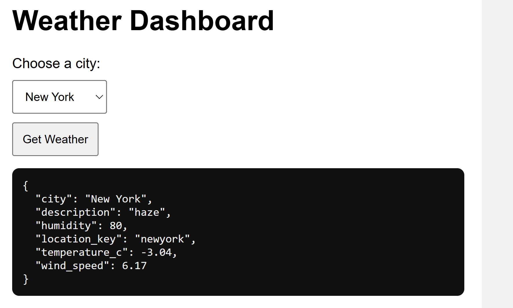

frontend
--------------

Running locally

Make sure the backend service is running before starting the frontend.

```bash
python3 -m venv .venv
source .venv/bin/activate
pip install -r requirements.txt

export BACKEND_URL="http://127.0.0.1:5000"
python app/app.py
```

Open in browser:
```bash
http://127.0.0.1:5001
```

Backend URL configuration
The frontend connects to the backend using the BACKEND_URL environment variable.
Example:
```bash
export BACKEND_URL="http://127.0.0.1:5000"
```

Dropdown options for cities

New York

Sydney

Cape Town

Bangkok

Screenshot of expected UI

